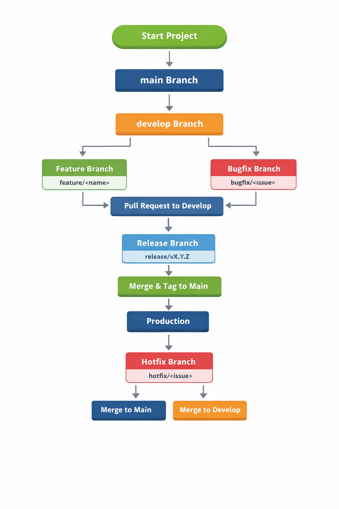

# SOP: Git Branching Strategy

**Repository:** J3AI-Image-Generator  
**GitHub:** https://github.com/jatinjangel/J3AI-Image-Generator

---

## 1. Introduction
This document defines the Standard Operating Procedure (SOP) for managing Git branches in the **J3AI-Image-Generator** project. The goal is to maintain clean code, enable smooth collaboration, and ensure stable releases.

---

## 2. Purpose
- Maintain structured development workflow
- Avoid merge conflicts
- Ensure stable production releases
- Support feature-based and experimental development

---

## 3. Scope
This SOP applies to:
- Project Owner
- Contributors
- Reviewers

---

## 4. Branching Strategy Overview

### Main Branches
| Branch | Description |
|------|------------|
| `main` | Production-ready stable code |
| `develop` | Ongoing development & integration |

### Supporting Branches
| Type | Naming Convention | Usage |
|----|------------------|------|
| Feature | `feature/<name>` | New feature development |
| Bugfix | `bugfix/<issue>` | Fix reported bugs |
| Release | `release/vX.Y.Z` | Prepare release |
| Hotfix | `hotfix/<issue>` | Critical production fix |

---

## 5. Branching Flowchart

> **Note:** This flowchart image visually explains the branching workflow.



---

## 6. Branch Workflow Process

### Feature Development
- Branch from `develop`
- Implement feature
- Create Pull Request to `develop`

```bash
git checkout develop
git pull origin develop
git checkout -b feature/new-ui
```

### Bug Fixing
- Branch from `develop`
- Fix bug
- PR to `develop`

### Release Process
- Create `release/vX.Y.Z` from `develop`
- Final testing & fixes
- Merge into `main`
- Create version tag

### Hotfix Process
- Create branch from `main`
- Fix critical issue
- Merge into both `main` and `develop`

---

## 7. Merge Rules

| Source | Target | Rule |
|------|--------|------|
| feature | develop | PR required |
| bugfix | develop | PR required |
| release | main | Tag mandatory |
| hotfix | main & develop | Immediate merge |

- No direct commits to `main`
- Code review required

---

## 8. Versioning
This project follows **Semantic Versioning**:

```
MAJOR.MINOR.PATCH
```

Example:
- v1.0.0 – First stable release
- v1.1.0 – New features
- v1.1.1 – Bug fixes

---

## 9. Best Practices
- Keep branches short-lived
- Write meaningful commit messages
- Regularly sync with `develop`
- Delete merged branches

---

## 10. Author

### Jatin Jangel
**Project Owner & Developer**  
B.Sc. Data Science


---

*This SOP is designed specifically for the J3AI-Image-Generator project to ensure professional Git workflow management.*

